# jbavsc - jBPM Business Application Extension for Visual Studio Code

Visual Studio Code extension used to generate your jBPM Business Applications.

This extension tries to provide a full experience when developing jBPM Business Apps
inside Visual Studio Code.

Currently it provides in-editor commands to:

1. **Generate** jBPM Business Apps
2. **Debug** jBPM Business Apps
3. **View** a business process (bpmn/bpmn2) visually
4. **Save Process SVG** from a business process (bpmn/bpmn2)

    (more to come **soon!**)

If you rather watch a videos on all the features then read the docs here is a list:

1. https://www.youtube.com/watch?v=Ay_eJSvCyUM&

---

## Table of Contents

-   [Commands](#commands)
-   [Usage](#usage)
    -   [Generate new app](#generate-new-app)
        -   [Generation Options](#generation-options)
        -   [App generation via Configuration](#app-generation-via-configuration)
        -   [Generated app in your working directory](#generated-app-in-your-working-directory)
    -   [Start your app](#start-your-app)
    -   [Debug your app](#debug-your-app)
    -   [Process Quick View](#process-quick-view)
-   [Building from source](#building-from-source)
-   [Contributing](#contributing)

---

## Commands

After installing this extension you will have two new commands available:

1. **Generate jBPM Business Application**
2. **Debug your jBPM Business Application**

These commands can be accessed via the Command Panellete. To open the Command Pallette
use F5 for Windows or ⇧⌘P on OSX).

The extension also updates the explorer context menu (menu shown when you right-click on a file in your project).
For files with extensions .bpmn or .bpmn2 it adds a new menu for the **process quick preview**.

## Usage

This section explains in detail how to use this extension and its commands.

### Generate new app

**Note:** you must be **online** to generate the business app. If you are not online the
extension will try to generate the app and will notify you that it can't do that.

To generate a new jBPM Business application open VS Code in a workspace (directory) where you would like to generate it, for example:

```
mkdir myappfolder
cd myappfolder
code .
```

Now open the Command Palette in VS Code and enter in the command:

```
> Generate jBPM Business Application
```


### Generation Options

You can chose to either generate your application using default settings, or can customize it via configurations:


After your selection and before the app gets generated you will be presented with a confirmation dialog:


Selecting the configuration generation option will guide you though a number of steps and then generate your business application in the current working directory.

### App generation via Configuration

If you chose to configure your jBPM Business app you want to generate you
will be guided through a 5 step process:

1. Application type: Here you can pick what app type you want to generate. Options are "Business Automation", "Decision Management", and "Business Optimization".


2. Application name: Enter your application name here, or leave the default "business-application" entry.


3. Application package name: Enter your application package name here, or leave the default "com.company" entry.


4. Application KIE version: Pick from one of the KIE versions. If the version you want to use is not available (we will update the versions as we update this extension in the future) you can always change it in your generated application pom.xml files.


5. Application components: Select one of the two availabe application components. If you would like to develop processes that use Case Management you should select the dynamic assets.


### Generated app in your working directory

After the generation process this extension will generate your jBPM Business app zip file and also extract it into your current working directory. You will see the generated app modules:

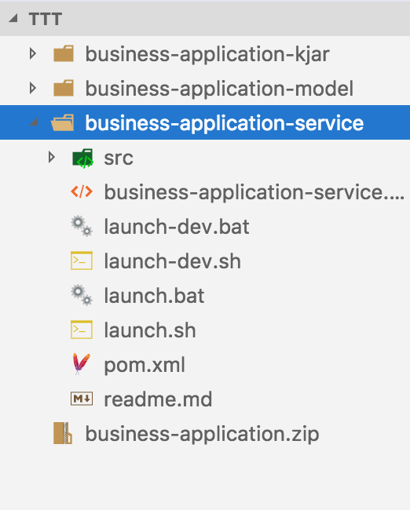

### Start your app

You can start your business app in VS Code as well, for that open the VS Code Terminal first, then
go into your apps \*service\*\* directory. In here you will find the various launch scripts for different
Operating systems. So for example on Unix/OSX you would do:


This will build your kjar, model, and services modules and launch your app (which is a spring boot app).
You will be able to access it in browser for example under

```
http://localhost:8090/
```

for more infomation about your business app go to the jbpm.org.

### Debug your app

---

**Important**

In order to debug your app currently there is need to update your apps DefaultWebSecurityConfig.java file which is generted for you by default.
This need will no longer be needed once jBPM community version 7.18.0.Final is released. For now you have to go to your apps **service** directory
and edit src/main/resources/DefaultWebSecurityConfig.java. Cut/paste the code from this Gist: https://gist.github.com/tsurdilo/3fe68ec089e226a007bdfc4852e293e9

These changes will enable CORS in your business app and will aloow the debug console to be able to get information from your running business application.
Without this change currently your debug console will **not** be able to query information from your business app.
Again, once the new community jBPM version is released (should be within a month) when you generate your business app this change will no longer
be necessary as the code mentioned in the gist will be included there by default.

---

Once your business app is started you can start debugging it.It makes sense however before to add some assets into your kjar module (business rules, business processes etc) which then you can debug.
Debugging feature will work without those, however there will be no processes to start and debug.

To add business processes to your business application add bpmn2 processes into your apps **kjar** module
in its src/main/resources folder and re-start your business app with the previously mentioned launch scripts. This will build and compile them so they are available when your app launches.

To start debugging your app launch the VS Code Command Palette and run the "Debug your jBPM Business Application" command.
Somilar to when generating your app you will first be presented with three quick steps asking to you provide info on where your business app is running:


By default your business app authentication user/password for the rest api are user/user. If you have changed that in your code, you need to
change the default values to reflrect your changes.

After these steps the extension will open a new editor window with your debug console:

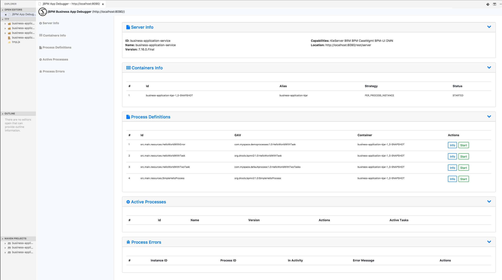

The debug console is made up of 5 collapsible sections:

1. **Server** info - gives you the basic information about your business app server:


2. **Container info** - gives you the basic information your deployed containers:


3. **Process Definitions Info** - lists all process definitions available across your containers:

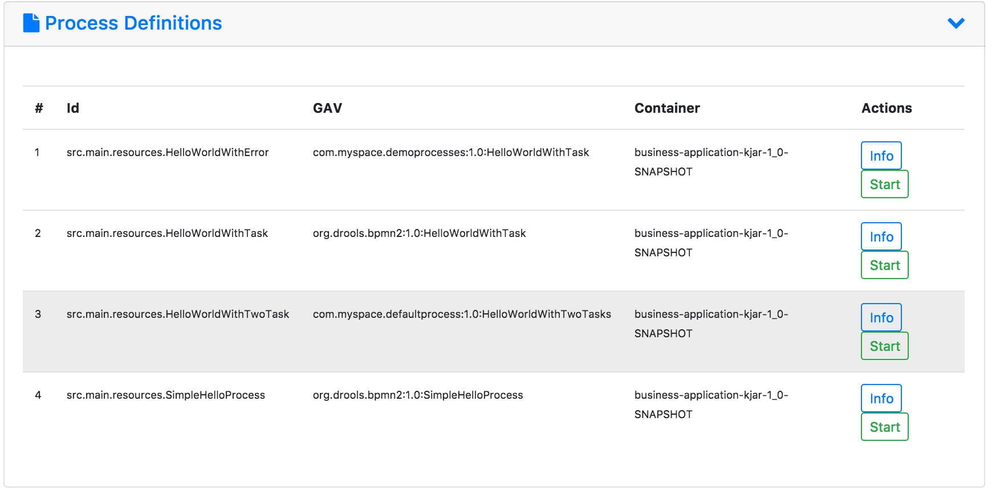

It allows you to view the process definitions image (clicking on the View button):

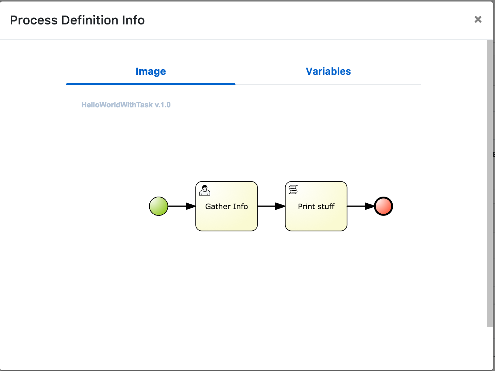

It also allows you to view the process definitions variables:

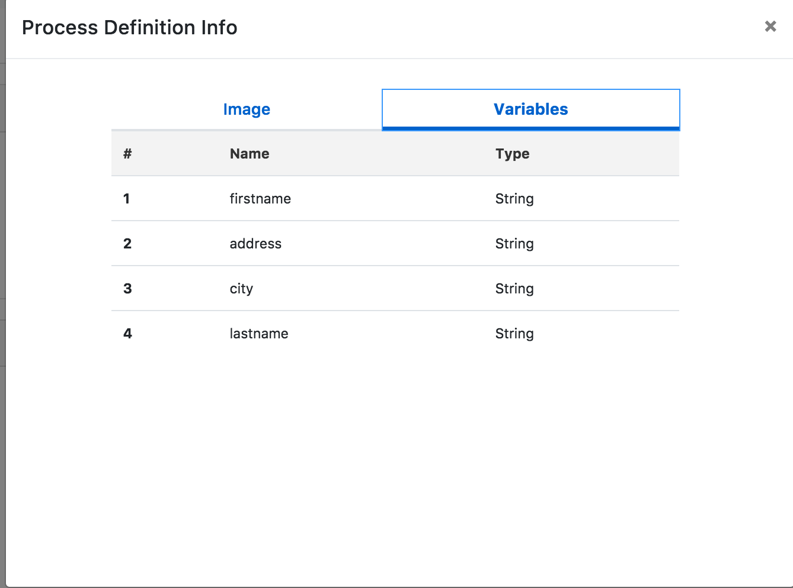

As well as start a process, which will then bring up the process form where you can fill in the initial variable values and start it:

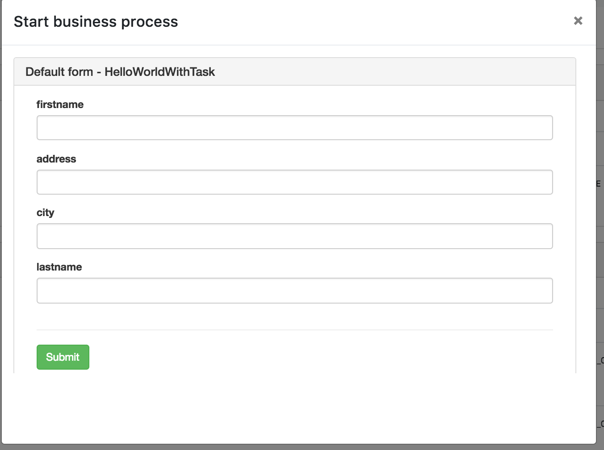

4. **Active Processes Info** - Lists all active process intsances:


Also allows you to view the current execution state of your process instance:

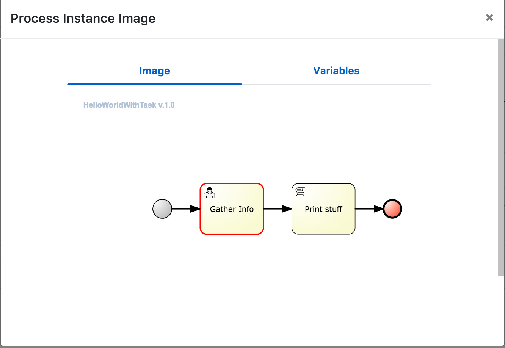

You can view the current values of all your process variables and also change/update their values for debugging purposes:

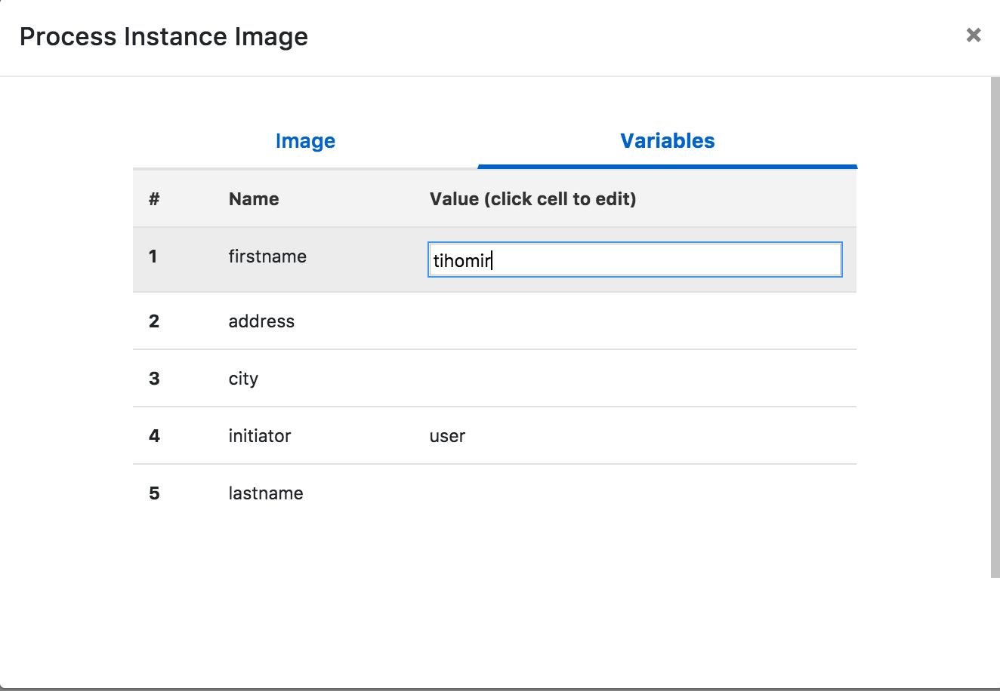

You can also abort a process instance if you wish:

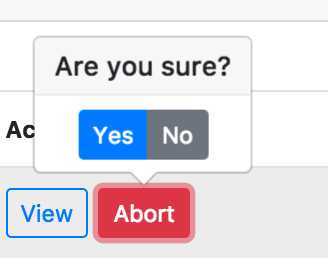

And also allow you to advance process execution by working on currently active tasks:

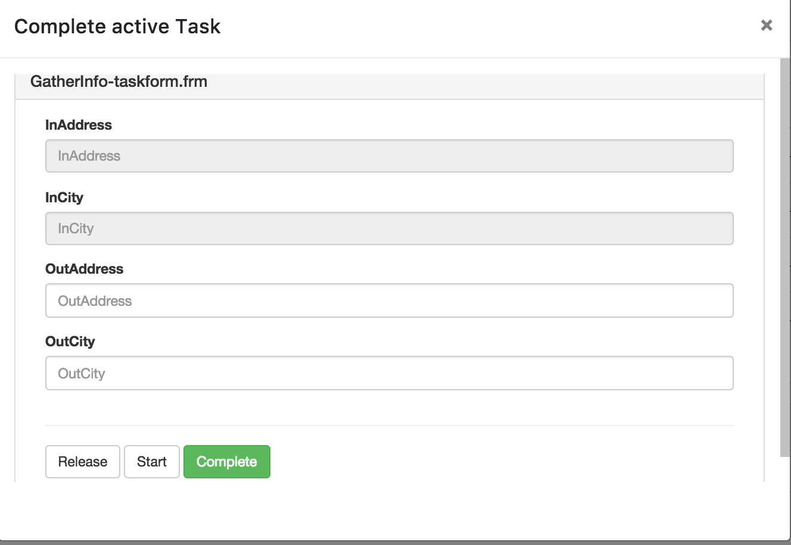

5. ** Process Errors** -- List all of execution errors that your business app encounters during process execution.


You can acknowledge an error, basically saying "yes, I will work to fix this", which will remove it from the error list.

## Process Quick View

To preview a business process visually (.bpmn, or .bpmn2 files) right-click on one of those files in your project and select "Process Quick View":

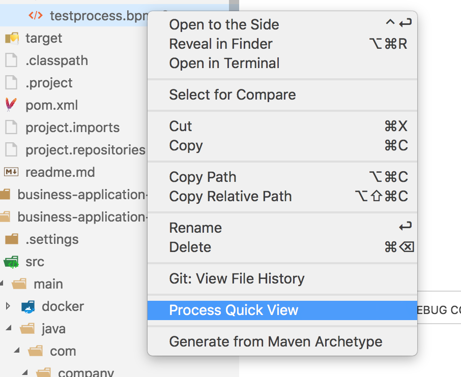

This will open a new editor window with the business process shown visually (using the camunda bpmn editor in preview mode):

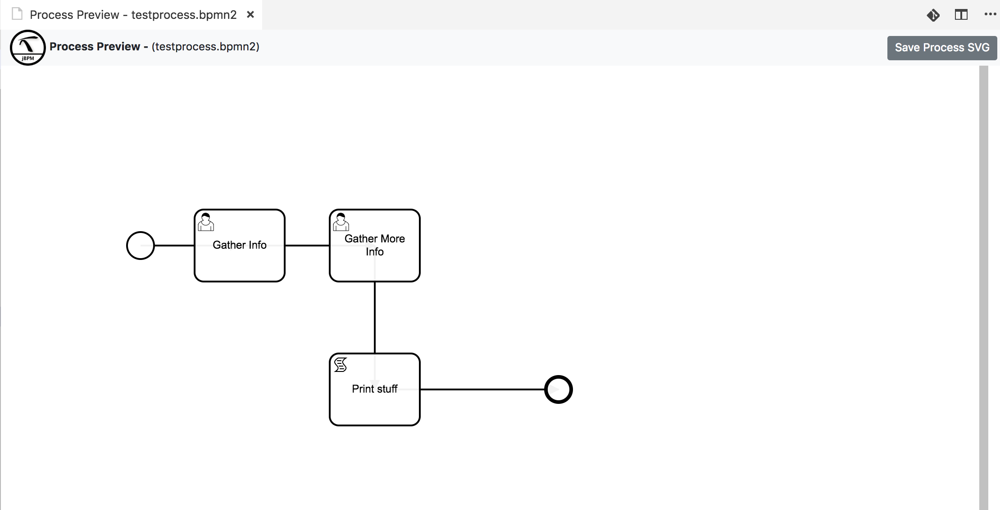

The process view is not editable (this will come soon!).

On top-right of the preview window is the "Save Process SVG" button which you can click to store the SVG representation
of the process:

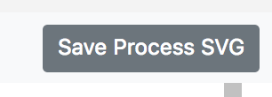

This is useful as then it can be viewed in the process debugging section of the extension.

Clicking on this button will create a new file or update an existing one. The naming of the generated svg file
is **process-id**-svg.svg which conforms to what the jBPM execution server expects so it can find it given the
process id of the process definition.

## Building from source

If you do not want to get this extension from the Marketplace or would like to build and test
the latest changes/updates locally follow these steps:

1. Clone the extension git repository

```
git clone https://github.com/BootstrapJBPM/jbavsc.git
cd jbavsc
```

2. Build and package the extension with vsce:

```
vsce package
```

To install vsce run:

```
npm install -g vsce
```

3. vsce will create a jbavsc-$VERSION$.vsix file which you have to install to your ide, for this run:

```
code --install-extension jbavsc-$VERSION$.vsix
```

to uninstall the extension run:

```
code --uninstall-extension jbavsc-$VERSION$.vsix
```

## Contributing

This extension is open-source and free to use to anyone.
All/any contributions are very welcome and much needed in order to make this extension much better.
Best way to contribute is to create Pull Request(s) on the github project.
